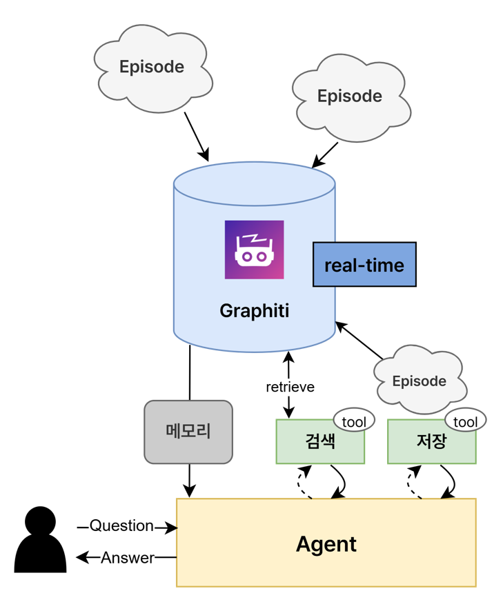

# Graphiti Agent Tutorial



[Graphiti](https://github.com/getzep/graphiti)를 사용하여 시간 지식 그래프를 구축하고, LangGraph를 통해 메모리 검색 및 저장 AI Agent 구축 튜토리얼


## Installation & Setting

```bash
pip install -qU langgraph langchain-core langchain-openai graphiti-core python-dotenv
```


`.env`:

```env
# Neo4j Database
NEO4J_URI=your_neo4j_uri
NEO4J_USERNAME=your_username
NEO4J_PASSWORD=your_password

# OpenAI API
OPENAI_API_KEY=your_openai_api_key
```

- [Neo4j Aura](https://neo4j.com/cloud/aura/) 또는 로컬 Neo4j 인스턴스 연결 정보


## Reference

- [Graphiti Github](https://github.com/getzep/graphiti)

- [Graphiti Documentation](https://help.getzep.com/graphiti/getting-started/welcome)
